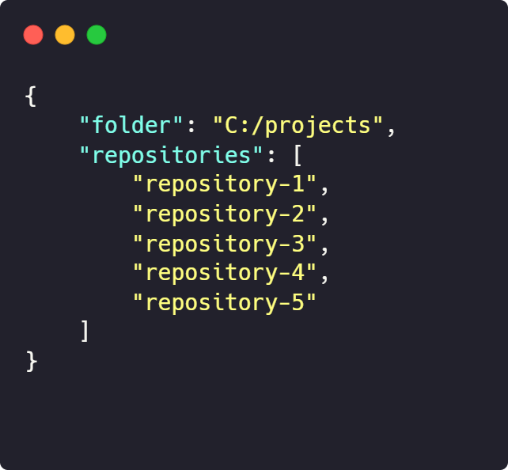

# Licenses Exporter

A tool to export the licenses in package.json from javascript/typescript projects into .csv files.

## 📦 Requirements

- [Node](https://nodejs.org/en/download)
- [Typescript](https://www.npmjs.com/package/typescript): `npm install -g typescript`

## 📄 Instructions

1. Run `npm install` to install the dependencies
2. Insert the `local folder` of your repositories and the `repositories` that you want to extract the dependencies in [repositories.json](repositories.json):

<p align="center">
    
    <p><em><b>Important:</b> you need to install these project dependencies before proceeding to the next step</em></p>
<p>

3. Run `npm start`
4. Check the output on console to ensure that all exports were succeeded
5. Check the generated folder [licenses](/licenses) for your .csv files

## 🖥️ Example Output

You can check the output .csv's on [licenses](/licenses/) folder:
<p align="center">
    
</p>


<h5 a><strong><code>repository-1.csv:</code></strong></h5>

```csv
Name,                                   Version,   License
2-thenable,                             1.0.0,     ISC 
@ampproject/remapping,                  2.2.0,     Apache-2.0 
@aws-sdk/service-error-classification,  3.110.0,   Apache-2.0 
@aws-sdk/types,                         3.110.0,   Apache-2.0 
@babel/code-frame,                      7.12.11,   MIT 
@babel/code-frame,                      7.18.6,    MIT
...
```

## ❓ QA

=====================================================

**Q:** Does it only work on TS/JS repos?

> **A:** Currently **yes**. Consider contributing to this feature implementation

=====================================================

**Q:** Can I change the output format (json, html, etc)?

> **A:** Currently **no**. Consider contributing to this feature implementation

=====================================================


**Q:** It says `"Error when trying to get licenses from..."`. What's happening?

> **A:** There are 2 possibilities:

> 1: The project's package.json needs to be at the root folder. You can provisionally move this file to the root folder ;)

> 2: The provided path is wrong or the folder doesn't exist

=====================================================